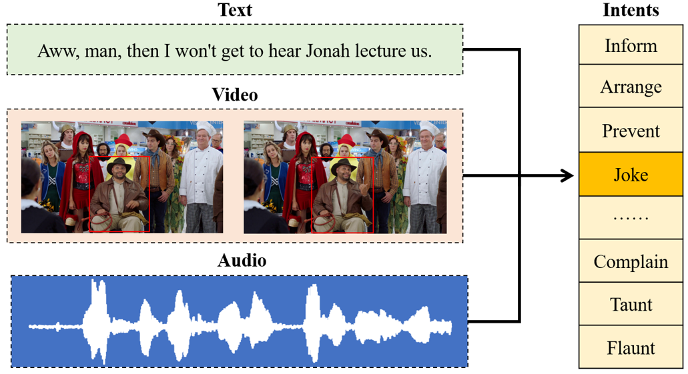
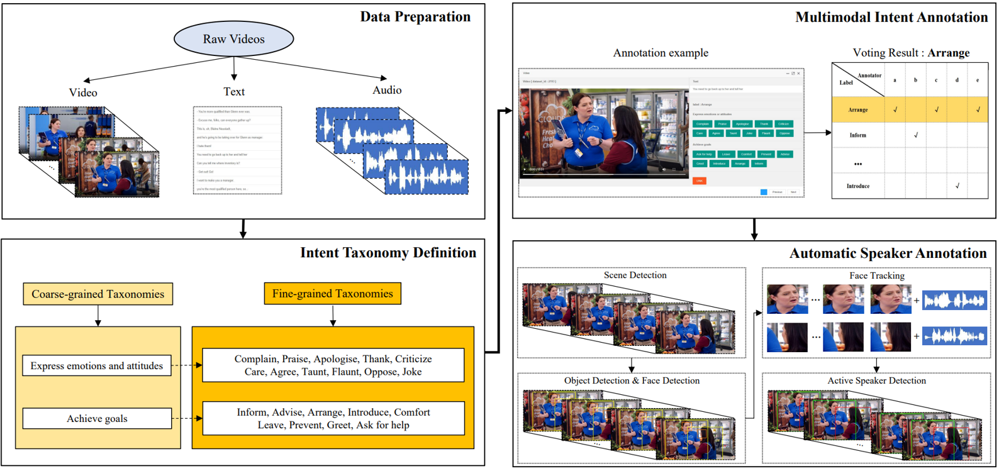
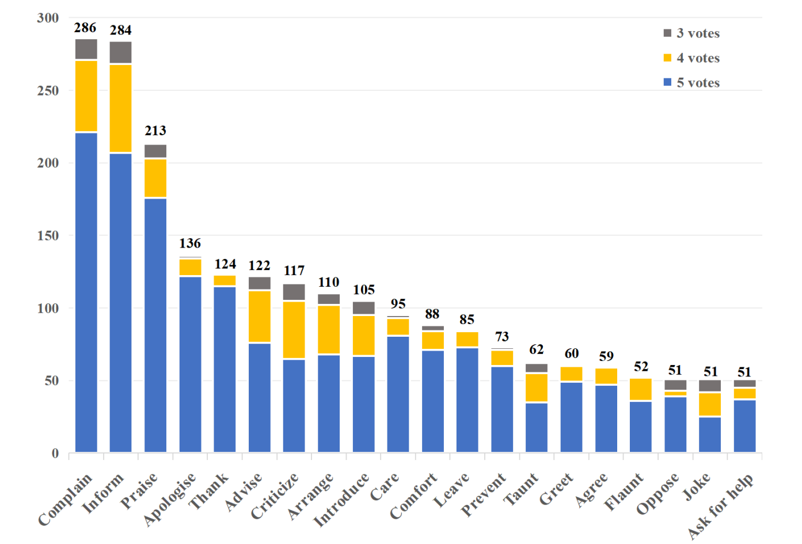

# Multimodal Intent Recognition (MIntRec)

This repo contains the official dataset and a unified framework for multimodal intent benchmarks of the research paper [MIntRec: A New Dataset for Multimodal Intent Recognition](https://dl.acm.org/doi/10.1145/3503161.3547906 "Link") (**Accepted by [ACM MM 2022](https://2022.acmmm.org/ "Link")**).

## 1. Introduction

In real-world conversational interactions, we usually combine information from multiple modalities (e.g., text, video, audio) to help analyze human intentions. Though intent analysis has been widely explored in the Natural Language Processing community, there is a scarcity of data for multimodal intent analysis. Thus, we provide a novel multimodal intent benchmark dataset, MIntRec, to boom the research. **To the best of our knowledge, it is the first multimodal intent dataset from real-world conversational scenarios.**

### An example of Multimodal Intent Recognition



## 2. Dataset Construction

The overall process of building the MIntRec dataset is shown below:



### a. Data sources

We collect raw data from the Superstore TV series. The reasons are that it contains (1) a wealth of characters (including seven prominent and twenty recurring roles) with different identities in the superstore and (2) a mass of stories in various scenes (e.g., shopping mall, warehouse, office).

### b. Intent taxonomies

In this work, we design new hierarchical intent taxonomies for multimodal scenes. Inspired by human intention philosophy and goal-oriented intentions in artificial intelligence research, we categorize two coarse-grained intent categories: "Express emotions or attitudes" and "Achieve goals".

We further categorize the two coarse-grained intent classes into 20 fine-grained classes by analyzing as many video segments and summarizing high-frequency intent tags. They are as follows:

#### Express emotions and attitudes

Complain, Praise, Apologize, Thank, Criticize, Care, Agree, Taunt, Flaunt, Oppose, Joke

#### Achieve goals

Inform, Advise, Arrange, Introduce, Comfort, Leave, Prevent, Greet, Ask for help.

<!--More detailed interpretations can be seen on !-->

### c. Multimodal Intent Annotation

Five annotators label the full dataset independently. They need to combine text, video, and audio information and determine one intent label with the most confidence. The qualified samples are saved with votes no less than three notes among the twenty fine-grained intent classes.

#### Dataset Distribution



#### Dataset Statistics

| Item                                      | Statistics |
| ----------------------------------------- | ---------- |
| Number of coarse-grained intents          | 2          |
| Number of fine-grained intents            | 20         |
| Number of videos                          | 43         |
| Number of video segments                  | 2,224      |
| Number of words in text utterances        | 15,658     |
| Number of unique words in text utterances | 2,562      |
| Average length of text utterances         | 7.04       |
| Average length of video segments (s)      | 2.38       |
| Maximum length of video segments (s)      | 9.59       |

### d. Automatic Speaker Annotation

We propose an automatic process for annotating the visual information towards speakers. It contains four main steps: (1) scene detection: distinguish different visual scenes in a video segment, (2) detect object boundings and corresponding faces, and establish a one-to-one mapping between them; and (3) face tracking: compute IoU for two faces in adjacent frames to judge whether they are from the same person, (4) TalkNet is used to perform audio-visual speaker detection, and we use the mapping in step 2 to obtain respective object boundings towards speakers.

This process is simple yet effective to generate over 120K keyframes within about 7 hours on 3090 Ti. We construct a data set with over 12K manual-annotated keyframes for testing. **The automatic speaker annotation process achieves a low missing rate (2.3%) and a high proportion (90.9%) with high-quality  predicted bounding boxes (IoU>0.9).**

## 3. Experiments

The text features are extracted by a pre-trained BERT language model. The vision features are extracted with ROI features of the pre-trained Faster R-CNN with backbone ResNet-50. The audio features are extracted by wav2vec 2.0 on audio time series (obtained with librosa at 16,000Hz). The tools for extracting video and audio features can be found [here](./tools).

The text benchmark is built by fine-tuning BERT. The multimodal intent benchmarks adapted from three powerful multimodal fusion methods, [MAG-BERT](https://github.com/WasifurRahman/BERT_multimodal_transformer), [MISA](https://github.com/declare-lab/MISA), and [MULT](https://github.com/yaohungt/Multimodal-Transformer). We also have another set of two annotators for human evaluation. The detailed results can be found [here](./results/results.md).

## 4. Usage

### a. Download data

You can download the full data from [Google Drive](https://drive.google.com/drive/folders/18iLqmUYDDOwIiiRbgwLpzw76BD62PK0p?usp=sharing) or [BaiduYun Disk](https://pan.baidu.com/s/1lAHdQ_RRaMw-DugtqRnEDg) (code：dbhc)

Dataset Description:

| Contents                       | Description                                                                                                                                                                                                                                                  |
| ------------------------------ | ------------------------------------------------------------------------------------------------------------------------------------------------------------------------------------------------------------------------------------------------------------ |
| audio_data/audio_feats.pkl     | This directory includes the "audio_feats.pkl" file. It contains audio<br />feature tensors in each video segment.                                                                                                                                          |
| video_data/video_feats.pkl     | This directory includes the "video_feats.pkl" file. It contains video<br />feature tensors for all keyframes in each video segment.                                                                                                                         |
| train.tsv / dev.tsv / test.tsv | These files contain (1) video segment indexes (season, episode, clip)<br />(2) clean text utterances (3) multimodal annotations (among 20 intent<br />classes) for training, validation, and testing.                                                       |
| raw_data                       | It contains the original video segment files in .mp4 format. Among<br />directory names, "S" means season id, "E" means episode id.                                                                                                                      |
| speaker_annotations            | It contains 12,228 keyframes and corresponding manual-annotated<br />bounding box information for speakers.<br />The speaker annotations are obtained by using a pre-trained Faster <br />R-CNN to predict "person" on images and select speaker index. |

### b. Quick start

1. Use anaconda to create Python (version >=3.6) environment

   ```
   conda create --name mintrec python=3.6
   conda activate mintrec
   ```
2. Install PyTorch (Cuda version 11.2)

   ```
   conda install pytorch torchvision torchaudio cudatoolkit=11.3 -c pytorch
   ```
3. Clone the MIntRec repository.

   ```
   git clone git@github.com:thuiar/MIntRec.git
   cd MIntRec
   ```
4. Install related environmental dependencies

   ```
   pip install -r requirements.txt
   ```
5. Run examples (Take mag-bert as an example, more can be seen [here](./examples))

   ```
   sh examples/run_mag_bert.sh
   ```

To do: We will provide more details of this framework in the Wiki document.

## 5. Citation

If you want to use the dataset, codes and results in this repo, please **star this repo and cite the following paper**:

* [MIntRec: A New Dataset for Multimodal Intent Recognition](https://dl.acm.org/doi/10.1145/3503161.3547906)

```
@inproceedings{10.1145/3503161.3547906,
   author = {Zhang, Hanlei and Xu, Hua and Wang, Xin and Zhou, Qianrui and Zhao, Shaojie and Teng, Jiayan},
   title = {MIntRec: A New Dataset for Multimodal Intent Recognition},
   year = {2022},
   doi = {10.1145/3503161.3547906},
   booktitle = {Proceedings of the 30th ACM International Conference on Multimedia},
   pages = {1688–1697},
   numpages = {10}
}
```

## 6. Acknowledgements

Some of the codes in this repo are adapted from the following repos, and we are greatly thankful to them: [MMSA](https://github.com/thuiar/MMSA), [TalkNet](https://github.com/TaoRuijie/TalkNet-ASD), [SyncNet](https://github.com/joonson/syncnet_python).

If you have any questions, please open issues and illustrate your problems as detailed as possible. If you want to integrate your method into our repo, please contact zhang-hl20@mails.tsinghua.edu.cn and feel free to  **pull request !**
